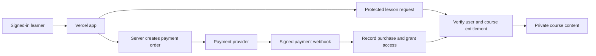

# Pricing and full-course access

The repository includes protected builds, Supabase course permissions, an owner-assignment command, a pricing page and verified Razorpay checkout/webhook handlers. This public release contains only previews and builds in protected mode. Full paid content and new authoring sources stay in Supabase and a private workspace. Production payment credentials and owner assignment stay on the server; see [COURSE_SETUP.md](COURSE_SETUP.md).

## Current offer and price

Sell a GATE 2027 course pass with a clear access period. Start with a useful free preview so students can judge the explanations and worked solutions before paying. A one-time course purchase fits an exam preparation goal and is simpler to explain than an ongoing subscription.

| Access | Offering | Price |
| --- | --- | --- |
| Free preview | Complete syllabus outline, 3 full preview lessons and 10 sample questions (one PYQ MCQ, three originals, six checks), and the learner's own notes/progress | Free |
| Early course pass | 72 lessons, 323 topic guides, 486 scored questions including 105 PYQ MCQs, full mocks, timed drills, recall cards, mistake review, private cloud notes and content updates; 12 months from purchase | ₹299 once through 31 October 2026, 11:59 PM IST |
| Regular course pass | The same complete course; 12 months from purchase | ₹499 once from 1 November 2026, 12:00 AM IST |
| Owner account | All course content and course-management permissions without payment or expiry | Free, assigned privately |

The discount has one fixed deadline shared by the frontend and server checkout. At `2026-10-31T18:30:00.000Z`, new orders use ₹499. It does not reset per visitor. Existing purchases should retain their promised terms if the price later changes. Do not charge separately for protecting or exporting a learner's existing personal notes.

Measure preview-to-purchase conversion, completed study sessions, refunds and learner feedback. Review the price against payment fees, hosting costs and support time. Ask early learners whether the examples helped them solve a new problem independently; example quantity alone is insufficient evidence of course quality.

## Content standard before charging

Every named topic should have a clear explanation of the idea, a procedure with its assumptions, and at least three different worked-example types:

1. **Basic walkthrough:** a small concrete case that makes the concept visible.
2. **Exam-style application:** an original question that requires applying or combining the concept. Label it as original practice rather than an official past question.
3. **Trap or edge case:** a counterexample, boundary condition or tempting wrong approach, explaining why it fails and what to do instead.

Each example needs a stated task, at least three reasoned steps, an answer and a result check. Use different operations or conceptual demands rather than merely substituting numbers. Review arithmetic, algorithms, SQL output and protocol assumptions before launch. Keep a visible route for reporting a content error and maintain correction history.

## Roles and private learner data

| Capability | Free learner | Paid learner | Owner |
| --- | --- | --- | --- |
| Browse course outline and preview lessons | Yes | Yes | Yes |
| Read full paid content | No | While course entitlement is valid | Always |
| Read/write own cloud notes and progress | Yes | Yes | Yes |
| Read another learner's private notes | No | No | No |
| Create/edit course content | No | No | Yes |
| Grant/revoke course access with an audit record | No | No | Yes |
| Assign owner privileges | No | No | Controlled server/database operation |

The owner role grants full course access. It should not bypass the existing privacy rules for learner notes. Learners must never be able to change their role, paid status, price or expiry by editing their progress JSON or browser storage.

Assign the initial owner using the exact Supabase Auth user UUID after confirming the intended account. Keep role assignment in a server-controlled database table, separate from `study_progress`. Do not hard-code an owner password, trust a browser-stored flag, or grant ownership merely because an email string matches in frontend JavaScript. Use strong account authentication and record owner access changes.

## Backend design

The current repository is public and the frontend serves the full `data/syllabus.json` as a static asset. Existing course text is already public. A frontend paywall cannot make that material private or prevent direct downloads. Charge for the ongoing course and tools with that fact understood; serve future restricted course content through protected backend reads, and keep its source in a private store/repository.

Vercel can continue hosting the frontend. Supabase can continue handling accounts and private progress. Add server functions for checkout/webhooks and protect full lesson content with Supabase row-level security or a server endpoint that checks access on every request.

Suggested tables:

- `account_roles`: server-managed `user_id` and `role` (`learner` or `owner`). Users may read their own role; they cannot update it.
- `course_entitlements`: `user_id`, `course_id`, `valid_until`, grant/revocation status and source payment. Users may read their own entitlement; trusted server operations write it.
- `payment_orders` and `payment_events`: server-calculated amount/currency/course, user ownership, provider order/payment IDs and processed-event uniqueness. Avoid storing card details.
- `course_content`: private complete lesson content, with free-preview metadata/content separate from restricted material.
- `access_audit`: who changed access, the affected learner, reason and timestamp.

Access is allowed when the authenticated user is an owner, the requested lesson is a preview, or an unrevoked course entitlement is still valid. An entitlement must belong to that authenticated user and its `course_id` must equal the requested lesson's server-stored course ID. Check this on the backend, including direct lesson URLs. The frontend can display pricing and access status but must not decide authorization by itself. Keep Supabase service-role and payment secrets exclusively in server environment variables.

Use a payment provider available to your business and learners; Razorpay is an option for an India-focused course, while other providers can be evaluated against their supported regions and checkout methods. Authenticate the learner and create orders on the server from an approved course price. Verify the provider's webhook signature and confirmed payment amount/currency before granting access. The provider order/payment ID must match a server-created `payment_orders` record. Derive the entitled user and course from that trusted order, never from browser metadata or an arbitrary callback user/course field. Browser checkout success alone is not payment proof.

Make webhook processing idempotent, retain unique provider event/payment IDs, and handle delayed or reordered events. Refunds or reversals should update the affected entitlement according to the published policy, without deleting personal notes. Test duplicate callbacks, failed payments, refunds, expired access and attempted role changes.

Do not include full paid lesson JSON, solutions or private source in the Vercel `dist` folder, public URLs or frontend bundle. Hiding navigation, obscuring filenames or checking a JavaScript role flag does not protect shipped content.

## Implementation sequence

1. Finish and independently review topic explanations and the three example types.
2. Decide the course price, access period, preview lessons and intended owner UUID.
3. Move future restricted content to a private backend; add owner roles and entitlement policies, retaining private progress isolation.
4. Implement protected lesson reads and the pricing/access UI.
5. Configure a payment provider, implement verified checkout/webhook flows and test in its sandbox.
6. Verify access on free, paid, expired and owner accounts, including direct HTTP requests; confirm owner accounts cannot read other users' personal notes.
7. Launch to a small group, monitor feedback and correct content issues before widening paid access.

The implementation uses the ₹299 limited-time offer for a 12-month pass, automatically restoring ₹499 after the deadline. The protected PYQ resource contains all 105 curated MCQs; only one sample is shipped publicly, so browser flags cannot retrieve the other 104. Course management and manual entitlement changes use trusted server/database operations; no browser admin editor or learner-data browsing tool is included. No payment account or owner identity has been configured by this update.
